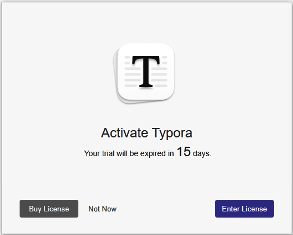
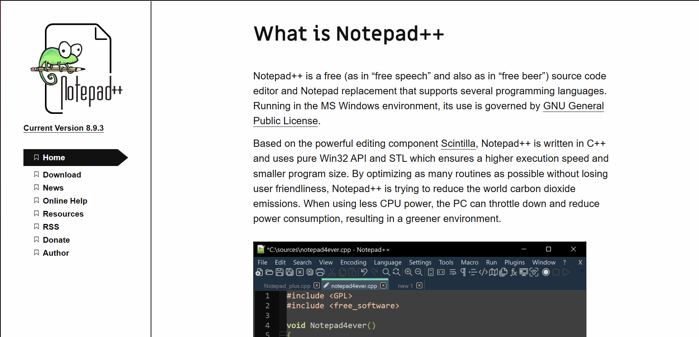
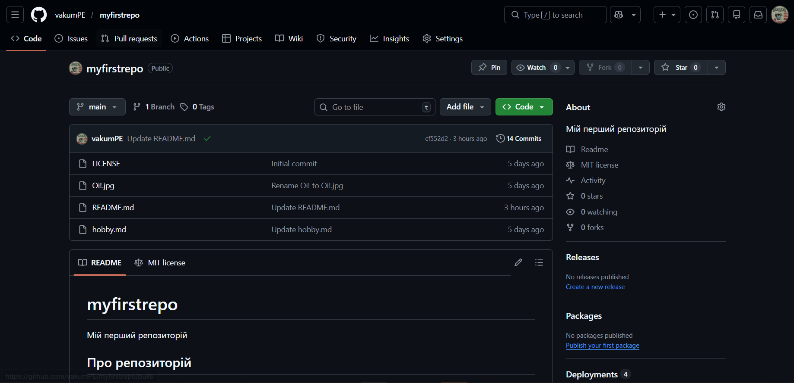
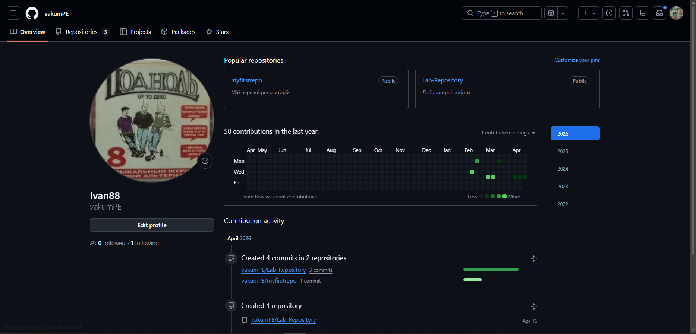
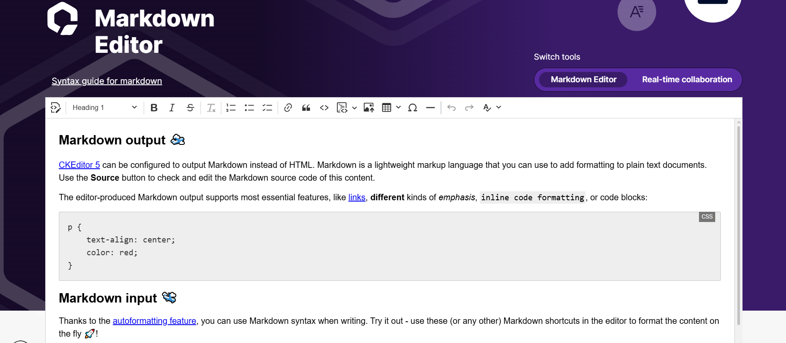
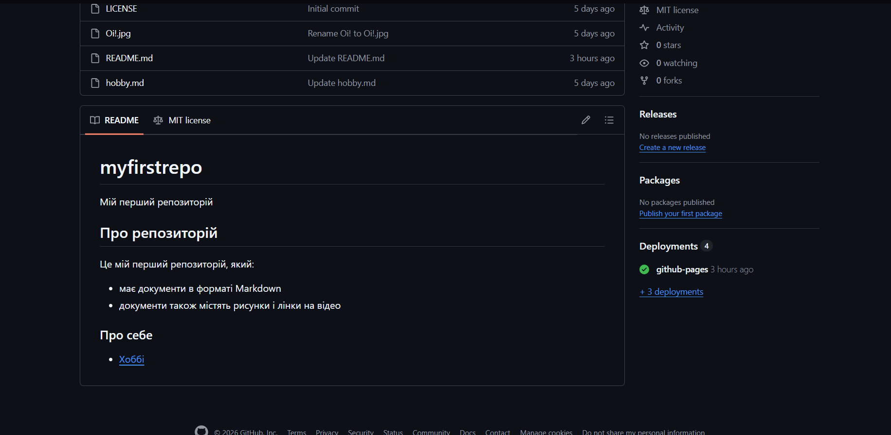
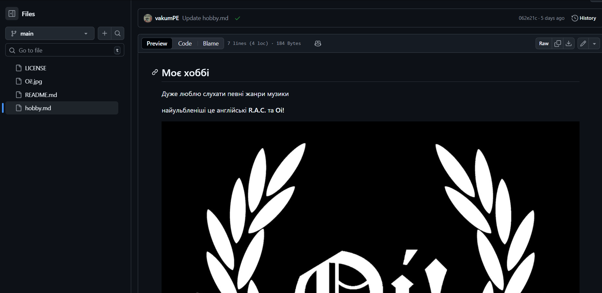

# Звіт до лабораторної роботи 1

завантажити Typora

 
завантажити Notepad++

 

зареєструватися на GitHub, знайти репозиторій pupenasan/Git4All, ознайомитись та залишити коментар 

створити свій публічний репозиторій, через онлайн редактор Markdown напишіть інформацію про ваш репозиторій, вставте цей текст в Readme

 

 Використовуючи вже відомий онлайн редактор створіть опис свого хоббі та вставте туди рисунок зі свого ПК. Скопіюйте зміст в новостворений файл на назвіть його hobby.md. 

