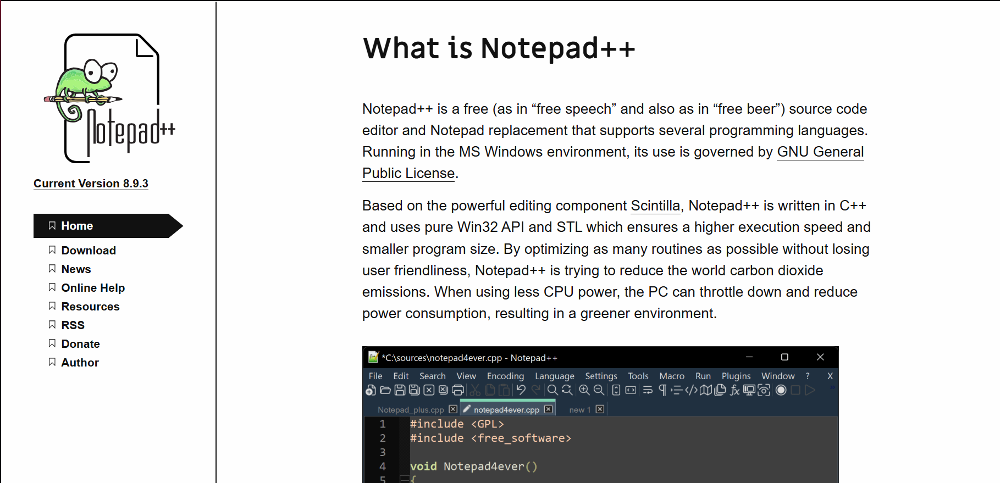
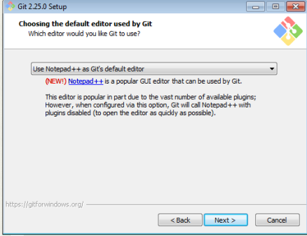
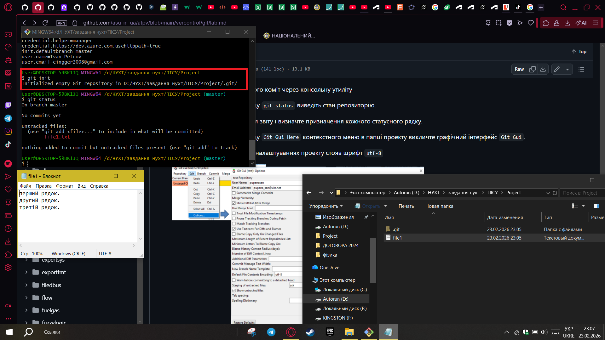
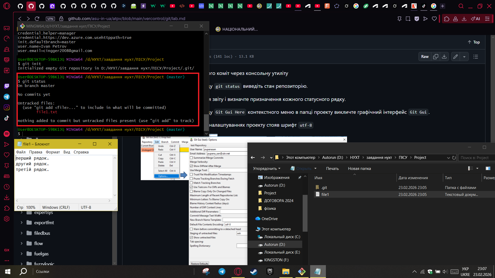
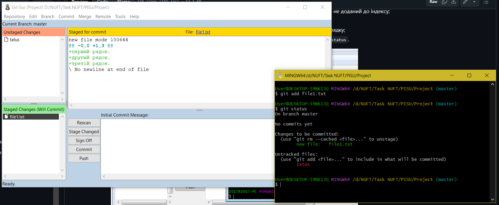
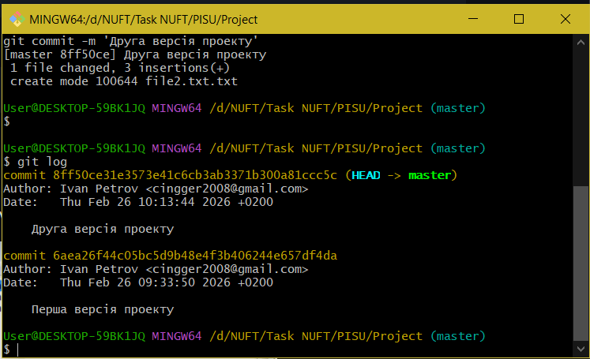
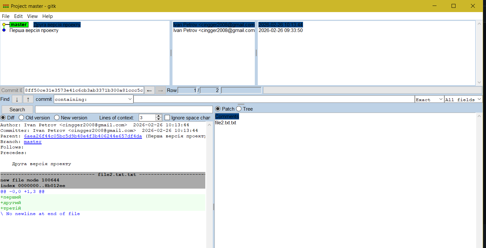
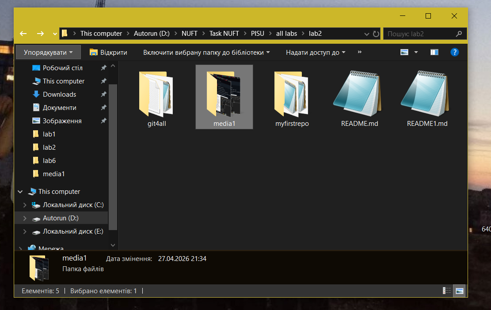
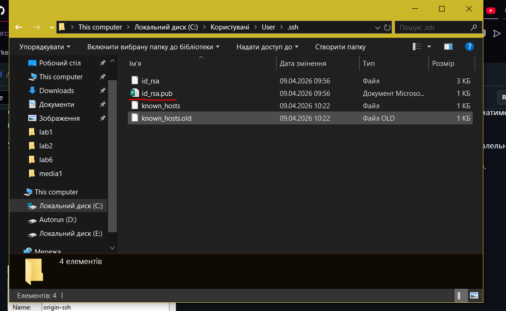
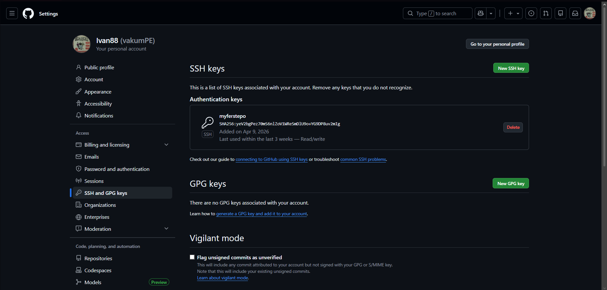

# Звіт до лабораторної роботи 1

При виконанні лабороторної роботи я зробив скріншоти, але не кожного етапу, тому деякі етапи будуть звичайним текстом

завантажити Notepad++ 

  

завантажити Git 

зареєструватися в Git

Ініціалізувати локального репозиторію через git init

Створити файл в робочій папці використовуючи Notepad++,  Використовуючи команду git status виведіть стан репозиторію,
в створений файл записати "перший рядок. другий рядок. третій рядок."

 Запустити команду для добавлення файлу на індексування, використовуючи команду git status вивести стан репозиторію.
 
 
 
  Запустіть команду коміту з повідомленням
  
  Створити новий файл в робочій директорії з назвою file2.txt. Записати туди три довільні рядки.
 У файлі file1.txt видалити другий рядок, та добавити в кінець рядок з написом четвертий рядок.
 Добавити обидва файли до індексу та зробіть коміт.
 
 
 
Відкрити графічний інтерфейс, викликати меню «Repository->Visualize master's History», передивитись історію комітів. 
 
 
 
Створити ще один README.md, записати туди автора, ресканим, стейдж ченжим, комітив і пушим

Клонувати існуючий репозиторій з GitHub (git4all) і власний репозиторій (myfirstrepo)

 
 в файл REAMDE.md в myfirstrepo вносимо зміни, комітим, пушим, внесемо зміни тепер черезе репозиторій на Github, комітим, використовуєм Fetch from
 
 в Merge -> Local Merge, обираємо origin/main та натиснути кнопку Merge. Дивимось історію зміни
 
 робимо конфлікт та розв'язуємо його (з перших декількох спроб не вдалось зробити конфлікт, все робив за методичкою)
 
 Відкриваємо Credential Manager, видаляємо усі знайдені записи для GitHub за допомогою кнопки Remove.
 
 створюємо приватний ssh ключ в консолі через команду ssh-keygen
 

  
  додати його на GitHub
  

   
додамо новий remot, туди додамо адресу репозиторію в форматі ssh, внесемо зміни в файл README, комітим, У вікні вибору remote обираємо origin-ssh, пушим, якщо все вірно то в нас попросить пароль  
  
10 пункт пропустити