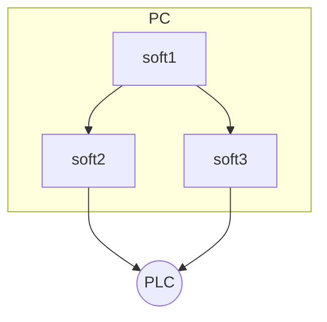

Створення документації на основі
================================
MarkDown: теоретична частина
----------------------------
### Базовий та елементи розширеного синтаксису
### MarkDown (MD)
-----------------------------------
__«Markdown»__ (створена John Gruber’s) — полегшена [мова розмітки даних](https://uk.wikipedia.org/wiki/Мова_розмітки_даних), яку створено з ухилом на
[прочитність](https://uk.wikipedia.org/wiki/Прочитність) та зручність у публікації з подальшим перетворенням її на структуровану валідність [XHTML](https://uk.wikipedia.org/wiki/XHTML) або
[HTML](https://uk.wikipedia.org/wiki/HTML).


рис.1. Принцип роботи застосунків Markdown.

 Екранування
 ===========
 зірочка - *

 Список
 ===========
  * Пункт в маркованому (ненумерованому) списку
     * Підпункт, відділений 4 пробілами
         * підпункт третього рівня, виділений 4 пробілами
 * Інший пункт в маркованому списку

 1. Пункт в нумерованому списку
 2. Інший пункт в нумерованому списку

Код
====
`Hello world!`
```python
for x in "banana":
    print(x)
```

## Цитати
> Весь цей абзац тексту є цитатою і буде поміщений у HTML blockquote елемент.
> Blockquote елементи змінюються в залежності від потреби/пристрою виводу.
> Ви можете обернути довільний текст за власним смаком,
> та воно перетвориться на єдиний blockquote елемент.	

## Таблиці
| Syntax     | Description | Test Text        |
|------------|-------------|------------------|
| Header     | Title       | Here’s this ---->|
| Paragraph  | Text        | And more         |

## Список завдань
- [x] Write the press release
- [ ] Update the website
- [ ] Contact the media

## Емоджі (смайли)

Gone camping! 🏕️ Be back soon.

That is so funny! 😂

# 2.  LaTeX/Mathematics 


$$
\cos(2\beta) = \cos^2 \beta - \sin^2 \beta
$$

$$
\lim_{y \to \infty} \exp(-y) = 0
$$

$$
k_{n+1}=n^3+k^2_n-k{n-1}
$$

$$
n^{22}
$$

$$
f(\alpha) =
\begin{cases}
\alpha / 2 & \text{if } \alpha \text{ is even} \\
-(\alpha + 1)/2 & \text{if } \alpha \text{ is odd}
\end{cases}
$$

# 3. Mermaid



​	

